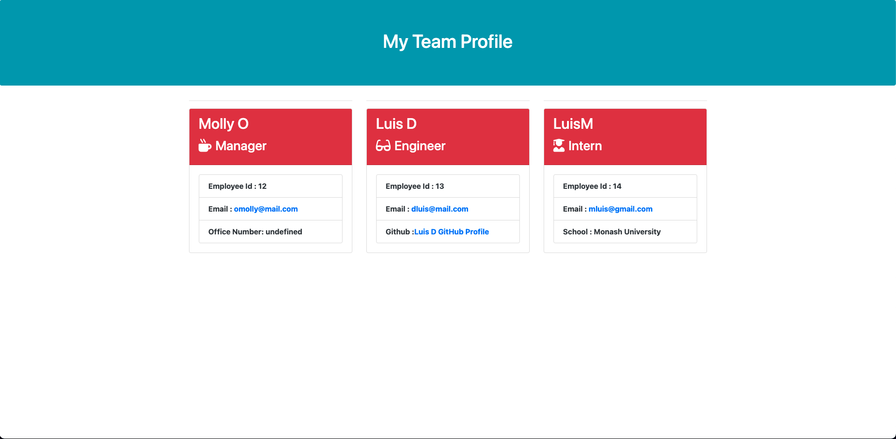

# Team-Profile-Generator

https://github.com/FadesOner/Team-Profile-Generator

# Description

This app allows the user imput info about their team in this case : Engineers, Managers and Interns.
This application was created using node.js and by using inquirer and jest dependencies, it generates a HTML file with the data provide.

# Table of contents

- Instalation
- Usage
- License
- Test
- Technologies
- Contact
- Image link
- Video Link

# Instalation

The following dependencies must be install in order for the app to work : Inquirer , jest 
You will also need Node.js

# License

This project is not licensed.

# Test 

To run this test you must type on the terminal : npm run test.

# Technologies

Html
Bootstrap
JavaScript
Node.js
Jest 
Inquirer 

# Contact

This was created by https://github.com/FadesOner, if you have any enquiry do not hesitate to emailing me at: luisdebourgm@gmail.com

# Image link

# Video link

https://user-images.githubusercontent.com/98502146/167278402-dcc38507-15b4-477d-bc62-93401613e405.mp4

